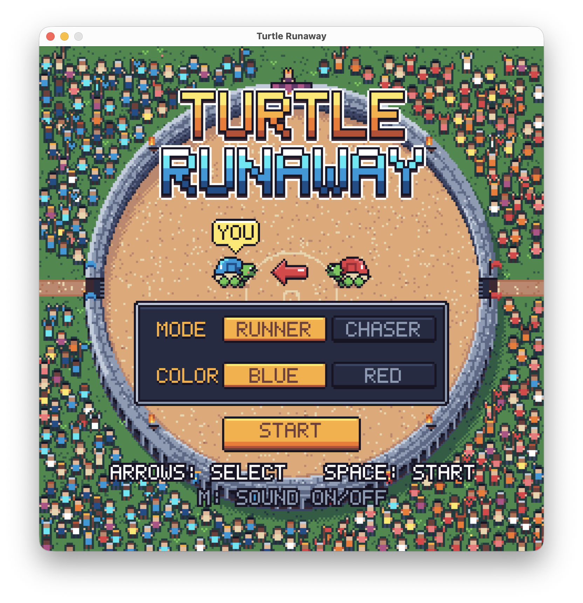
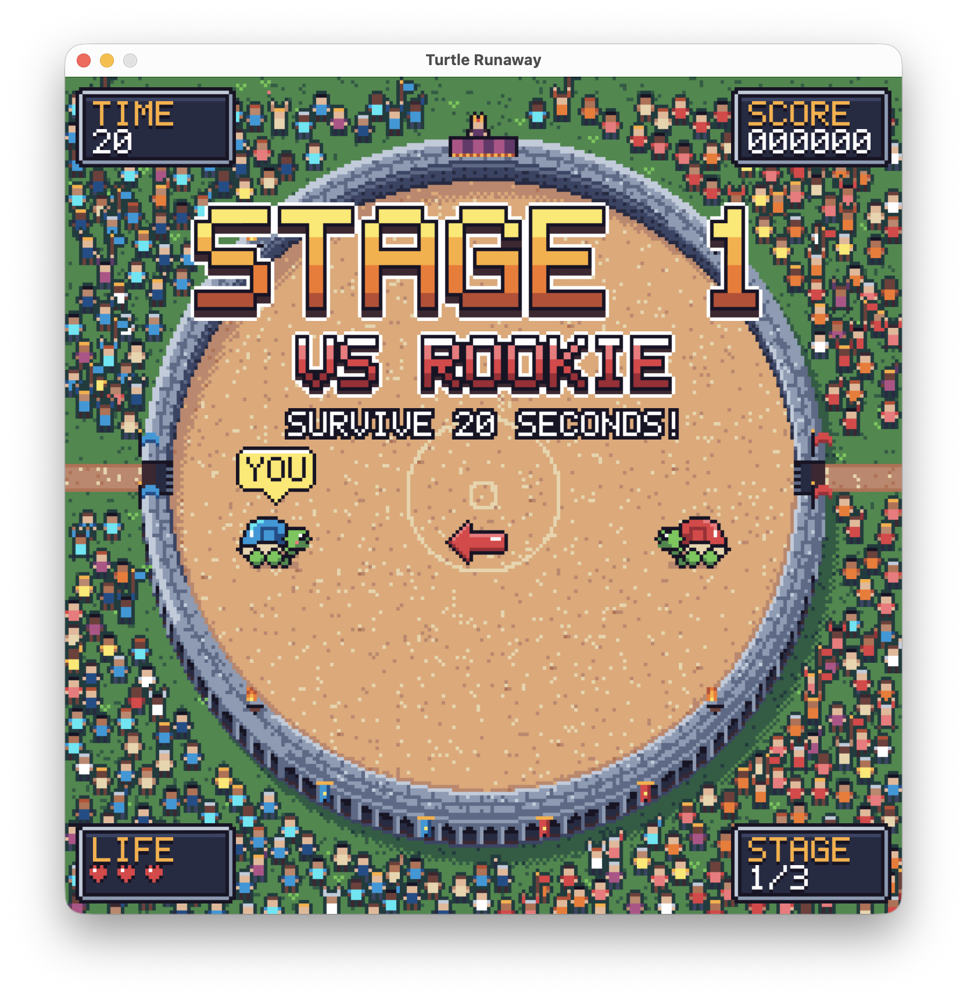
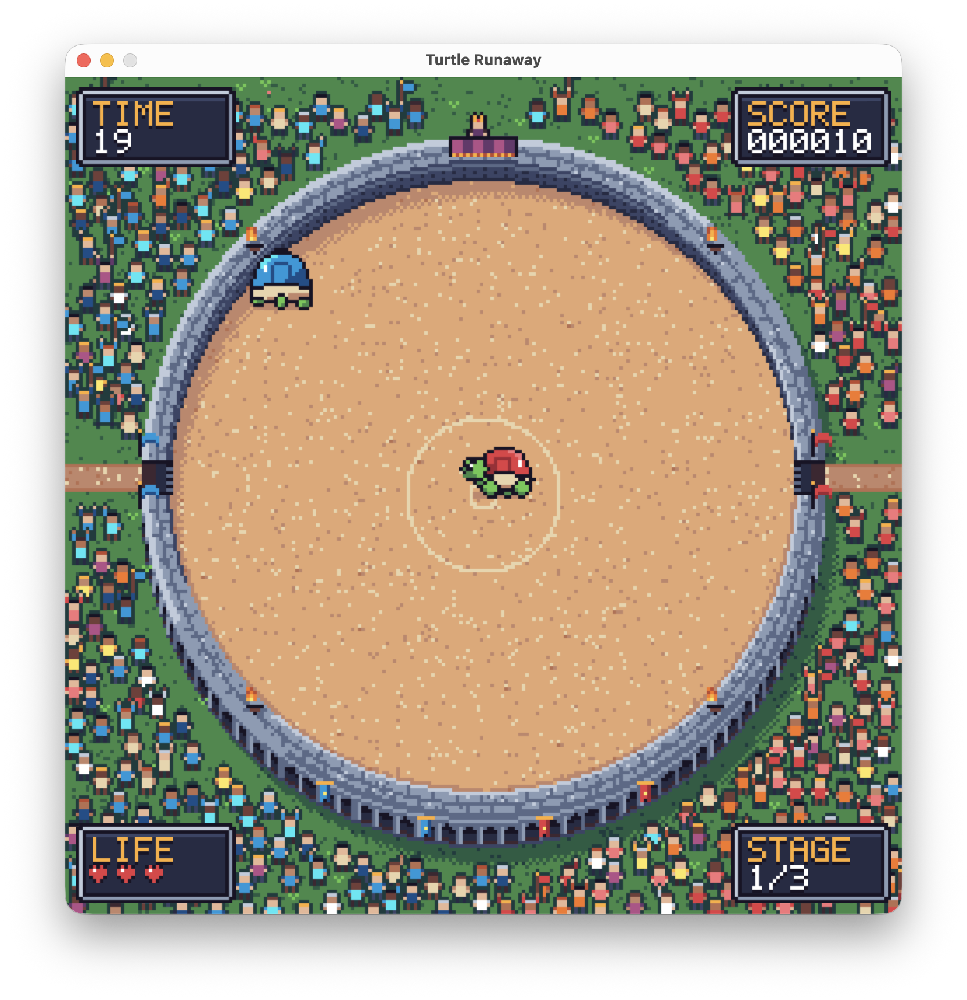
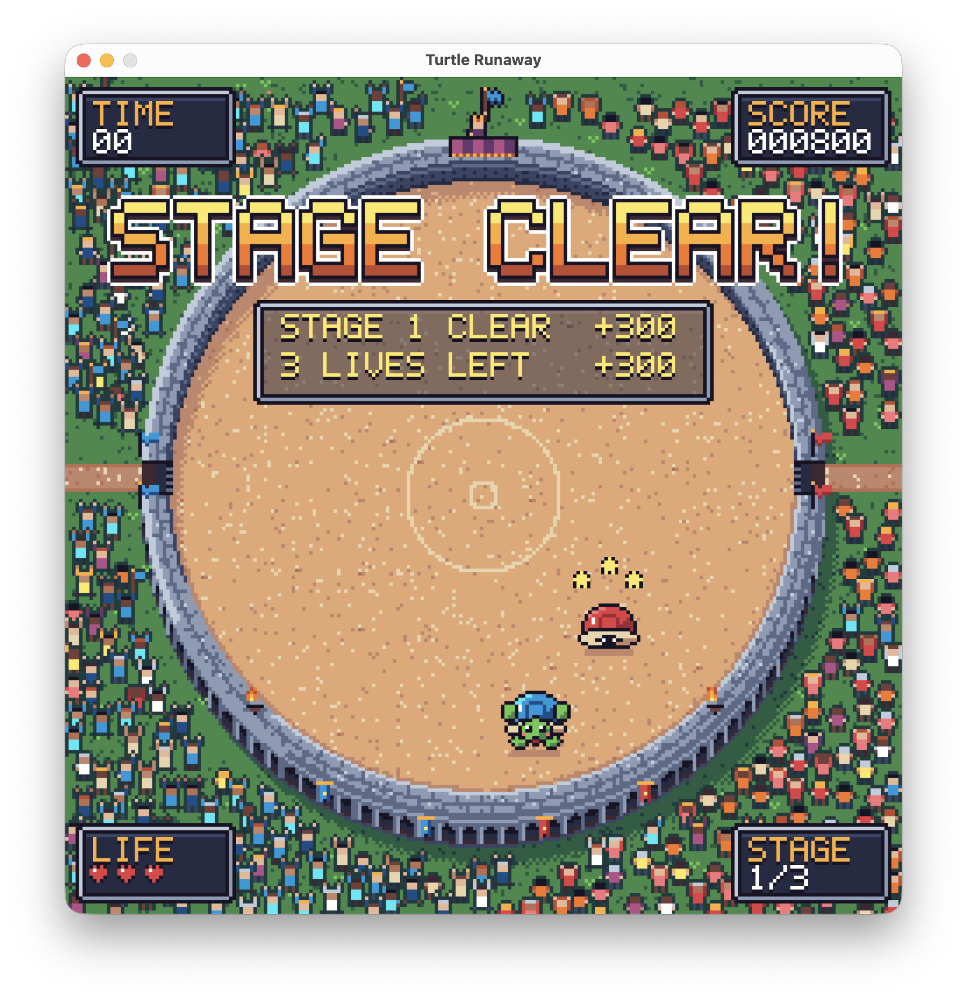
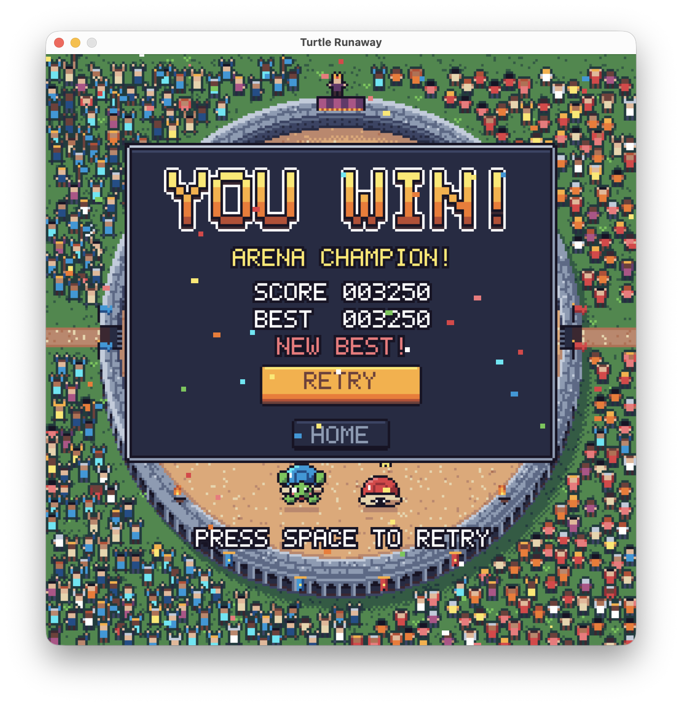

# Turtle Runaway

> 8비트 도트 콜로세움에서 벌어지는 파랑 거북이와 빨강 거북이의 술래잡기



<table>
  <tr>
    <td></td>
    <td></td>
  </tr>
  <tr>
    <td align="center"><b>게임 시작</b></td>
    <td align="center"><b>게임 중</b></td>
  </tr>
  <tr>
    <td></td>
    <td></td>
  </tr>
  <tr>
    <td align="center"><b>라운드 종료</b></td>    
    <td align="center"><b>게임 종료</b></td>
  </tr>
</table>


---

## 게임 방법 (한눈에 보기)

**실행:** `python turtle_runaway.py` (Spyder에서는 IPython 콘솔에 `!python turtle_runaway.py`)
- `sounds/` 폴더가 `turtle_runaway.py`와 같은 폴더에 있어야 소리가 납니다. 폴더가 없어도 게임은 소리 없이 실행됩니다.
- 추가 설치는 필요 없습니다. Python 기본 모듈(`tkinter`, `turtle`)만 사용합니다.

**1. 홈 화면에서 모드와 내 거북이를 고릅니다.**

| 모드 | 나의 역할 | 목표 |
|---|---|---|
| **RUNNER** | 도망자 | 제한 시간 동안 잡히지 않고 버티기 |
| **CHASER** | 추격자 | 제한 시간 안에 상대를 잡기 |

**2. 조작**

| 키 | 동작 |
|---|---|
| 방향키 또는 `W` `A` `S` `D` | 이동 (대각선 이동 가능) |
| `Space` / `Enter` | 게임 시작, 게임이 끝난 뒤 같은 설정으로 다시 하기 |
| `HOME` 버튼 (마우스 클릭) | 홈 화면으로 돌아가기|
| `M` | 소리 켜기 / 끄기 |

**3. 규칙**
- 스테이지는 3개입니다: **ROOKIE**(20초) → **GLADIATOR**(25초) → **CHAMPION**(30초).
- 목숨은 게임 전체에서 **3개**입니다. 라운드에서 지면 하나를 잃고, 모두 잃으면 게임 오버입니다.
- 세 스테이지를 모두 깨면 **ARENA CHAMPION**입니다.

**4. 팁**
- 남은 시간이 **5초**가 되면 `SPEED UP!`과 함께 추격자가 30% 빨라집니다.
- CHAMPION이 멈추고 머리 위에 **`!`**가 뜨면 곧 돌진합니다. 옆으로 피하세요.
- AI는 나보다 방향 전환이 느립니다. 도망칠 때는 옆으로 꺾고, 쫓을 때는 모퉁이를 가로질러 가세요.

---

## 게임 소개와 컨셉

**"거북이 검투사들의 콜로세움"** 을 컨셉으로 만든 게임입니다. 왕이 지켜보는 원형 경기장 한가운데서 파랑 거북이와 빨강 거북이가 술래잡기를 벌입니다. 경기장을 둘러싼 관중 328명이 두 팀을 응원합니다. 서쪽 관중석은 파랑 응원단, 동쪽 관중석은 빨강 응원단입니다. Claude Code를 활용해 제작했습니다.

- **도트 그래픽을 전부 코드로 그렸습니다.** 이미지 파일 없이, 240×240 도트 화면을 파이썬 코드로 한 점씩 그리고 3배로 키워 720×720 창에 표시합니다. 경기장, 관중, 왕, 거북이, 글꼴(5×7 도트 폰트), 버튼, 이펙트가 모두 해당합니다. 색은 픽셀아트용 팔레트 ENDESGA 32를 사용했고, 각 부품에 외곽선과 명암(왼쪽 위에서 오는 빛)을 넣었습니다.
- **살아 있는 경기장입니다.** 관중은 저마다 다른 타이밍에 손을 흔들고 뛰며 응원하고, 횃불과 깃발도 흔들립니다. 라운드가 끝나면 이긴 팀의 관중은 환호하고 진 팀의 관중은 고개를 떨구거나 머리를 감싸 쥡니다. 관중석 위 로열 박스의 왕은 라운드마다 이긴 팀의 깃발을 들고, 게임이 끝나면 일어나 박수를 칩니다.
- **귀엽고 가벼운 8비트 사운드를 넣었습니다.** 홈 화면, 경기, 종료 화면마다 다른 칩튠 배경음악이 나옵니다. 관중 함성과 버튼, 카운트다운, 승리, 패배, 시간 임박 효과음도 있습니다. 모두 자유롭게 쓸 수 있는 CC0 음원입니다.

---

## 과제 요구사항 구현

### 필수 1. 타이머 (Timer)
- 스테이지마다 **카운트다운 타이머**가 있습니다(20초, 25초, 30초). 남은 시간은 화면 왼쪽 위 `TIME` 칸에 표시됩니다.
- 남은 시간이 5초 이하가 되면 숫자가 **빨갛게 깜빡이고**, 시계 소리가 째깍거리며 음악이 빨라집니다.
- 프레임 수가 아니라 **실제 흐른 시간**(`time.monotonic()`)으로 시간을 잽니다. 그래서 컴퓨터 속도와 상관없이 1초는 정확히 1초입니다.
- 모드마다 타이머가 쓰이는 방식이 다릅니다.
  - **RUNNER:** 시간이 0이 되면 버틴 것이므로 스테이지 클리어입니다. 잡혀도 타이머는 **남은 시간부터 이어집니다**.
  - **CHASER:** 시간이 0이 되면 `TIME UP!`으로 목숨을 잃고, 같은 스테이지를 **처음부터 다시** 도전합니다.

### 필수 2. 지능형 거북이 (Intelligent Turtle)
도망자와 추격자 **두 역할 모두 AI를 만들었습니다.** 플레이어가 고른 모드에 따라 상대 거북이가 둘 중 하나를 맡습니다.

**추격자 AI `ChaseMover`** (RUNNER 모드의 상대)
- **예측 조준:** 도망자의 속도를 계속 추정해서(부드럽게 평균) 도망자가 **갈 곳을 앞질러** 노립니다. 가까워질수록 예측을 줄여 정확히 달려듭니다.
- **회전 속도 제한:** 한 번에 방향을 확 틀지 못하고 초당 정해진 각도만큼만 돕니다. 그래서 플레이어가 옆으로 피하는 무빙이 통합니다.
- **돌진 공격 (CHAMPION):** 가까이 오면 잠깐 멈춰 힘을 모으고(`!` 표시와 경고음), 곧바로 2.3배 속도로 돌진합니다. 돌진 중에는 방향을 못 바꾸기 때문에, 예고를 보고 옆으로 피할 수 있게 만들었습니다.

**도망자 AI `RunawayMover`** (CHASER 모드의 상대)
- **벽 타고 돌기:** 추격자의 반대쪽으로 달리다가 벽에 가까워지면 벽을 따라 돕니다. 이때 추격자에게서 멀어지는 방향으로 돕니다. 구석에 갇히지 않습니다.
- **페인트 (juke):** 추격자가 일정 거리 안으로 들어오면 **경기장 가운데 쪽으로 90° 꺾으며** 순간 가속해 빠져나갑니다.
- **사람다운 빈틈:** 일정 간격(0.18~0.3초)마다만 다시 판단하고 방향도 조금씩 흔들리기 때문에, 플레이어가 길목을 가로질러 잡을 수 있습니다.

**공통**
- 두 거북이 모두 원형 경기장 밖으로 나갈 수 없습니다.
- 마지막 5초에는 추격자(AI든 플레이어든)가 **1.3배** 빨라집니다.
- 스테이지가 올라갈수록 속도, 회전, 예측, 반응이 강해집니다. 난이도는 봇 플레이어를 붙인 시뮬레이션을 여러 번 돌려서 조정했습니다(아래 [스테이지와 난이도](#스테이지와-난이도) 참고).

### 필수 3. 점수 체계 (Scoring System)
아래 [점수 체계](#점수-체계)에 자세히 정리했습니다. 요약하면 **버틴 시간, 스테이지 클리어, 남은 목숨, (CHASER 모드는) 빨리 잡은 시간**에 점수를 줍니다. 모드별 최고 점수(BEST)도 기록합니다.

### 선택 항목

| 선택 요구사항 | 구현 여부 | 내용 |
|---|:---:|---|
| 창 제목을 `Turtle Runaway`로 변경 | O | `root.title('Turtle Runaway')` |
| 배경 / 경기장 추가 | O | 도트 콜로세움: 모래 바닥, 돌벽과 아치, 동서 출입문, 횃불, 깃발, 로열 박스, 관중 328명. 거북이는 원 밖으로 못 나갑니다 |
| 스테이지 개념 추가 | O | ROOKIE, GLADIATOR, CHAMPION 3단계. 시간과 AI 능력치가 스테이지마다 다릅니다 |
| 오프닝, 클로징, 엔딩 장면 | O | 오프닝(로고와 메뉴), 스테이지 인트로, 게임 오버(클로징), 우승(엔딩). 아래 [장면 구성](#장면-구성) 참고 |
| 버그 수정 (예: 색 바뀜) | O | 색이 역할이 아니라 **거북이 자체**에 붙도록 고쳤습니다. 키보드 조작 문제도 함께 고쳤습니다. 아래 [스켈레톤 코드에서 달라진 점](#스켈레톤-코드에서-달라진-점) 참고 |
| 그 밖에 재미 요소 | O | 게임 모드 2가지와 캐릭터 선택, 목숨, 사운드, 관중과 왕의 반응, 이펙트, 최고 점수 |

---

## 점수 체계

화면 오른쪽 위 `SCORE` 칸에 6자리로 표시됩니다.

| 점수 | 받는 조건 | 점수 | 주는 이유 |
|---|---|---|---|
| 생존 점수 | RUNNER 모드에서 1초 버틸 때마다 | **+10** | 잡히지 않고 버틴 만큼 |
| `STAGE n CLEAR` | 스테이지 클리어 | **+300 × n** (300, 600, 900) | 뒤 스테이지일수록 어려우므로 더 많이 |
| `TIME LEFT nS` | CHASER 모드에서 클리어할 때 남은 시간 1초당 | **+20** | 빨리 잡을수록 더 많이 |
| `n LIVES LEFT` | 스테이지 클리어할 때 남은 목숨 1개당 | **+100** | 목숨을 덜 잃을수록 더 많이 |

- 스테이지를 깨면 반투명 창에 보너스가 **한 줄씩 코인 소리와 함께** 올라가며 점수에 더해집니다. 뒤에 있는 거북이가 창에 가려지지 않게 창을 반투명하게 만들었습니다.
- 게임이 끝나면 점수와 **모드별 최고 점수(BEST)** 를 보여 줍니다. 최고 기록을 넘으면 `NEW BEST!`가 깜빡입니다. BEST는 게임을 켜 둔 동안 유지됩니다.
- **RUNNER 모드 만점은 3,450점**입니다. 계산은 다음과 같습니다.
  - 생존 점수: 20+25+30초 × 10 = 750
  - 클리어 보너스: 300+600+900 = 1,800
  - 목숨 보너스: 3개 × 100 × 3스테이지 = 900

---

## 스테이지와 난이도

플레이어는 초당 **165px**로 움직이고, 두 거북이 사이가 **44px**보다 가까워지면 잡힌 것으로 판정합니다.

**RUNNER 모드: 나를 쫓는 AI 추격자**

| 스테이지 | 시간 | 속도 (px/s) | 회전 (°/s) | 예측 조준 | 특수 능력 |
|---|:---:|:---:|:---:|:---:|---|
| ROOKIE | 20초 | 105 | 160 | 0.10초 앞 | - |
| GLADIATOR | 25초 | 121 | 180 | 0.15초 앞 | - |
| CHAMPION | 30초 | 126 | 195 | 0.20초 앞 | `!` 예고 후 돌진 |

마지막 5초에는 1.3배가 되어 CHAMPION은 초당 약 164px로, 플레이어와 거의 같은 속도가 됩니다.

**CHASER 모드: 내가 쫓는 AI 도망자**

| 스테이지 | 시간 | 속도 (px/s) | 회전 (°/s) | 판단 간격 | 페인트 거리 / 가속 |
|---|:---:|:---:|:---:|:---:|:---:|
| ROOKIE | 20초 | 160 | 300 | 0.30초 | 100px / 1.4배 |
| GLADIATOR | 25초 | 168 | 330 | 0.25초 | 110px / 1.5배 |
| CHAMPION | 30초 | 180 | 360 | 0.18초 | 120px / 1.8배 |

CHASER 모드에서는 마지막 5초에 **내가** 1.3배 빨라집니다.

**난이도 조정 방법:** 플레이어 대신 움직이는 봇을 만들어 각 스테이지를 수십 번씩 시뮬레이션했습니다. 봇은 벽을 따라 도는 초보형, 반응이 느린 봇, 앞을 내다보고 피하는 숙련형 등 여러 수준으로 만들었습니다. 그 결과를 보고 "ROOKIE는 쉽게, GLADIATOR는 방심하면 잡히게, CHAMPION은 마지막 5초가 진짜 승부"가 되도록 수치를 맞췄습니다.

---

## 장면 구성

```
오프닝(홈 화면) → 스테이지 인트로 → READY → GO! → 경기

경기에서 이기면 → STAGE CLEAR! (보너스) → 다음 스테이지 인트로
                  └ 3스테이지까지 모두 깨면 → 엔딩 (YOU WIN!)
경기에서 지면   → CAUGHT! / TIME UP! (목숨 -1) → READY부터 다시
                  └ 목숨이 0이 되면 → 클로징 (GAME OVER)

엔딩 / 클로징 → Space: 같은 설정으로 다시 시작 | HOME 버튼: 오프닝으로
```

| 장면 | 연출 |
|---|---|
| **오프닝 (홈 화면)** | 로고가 위에서 떨어지며 튕깁니다. 두 거북이가 출입문에서 걸어 들어오고, 모드·색 선택 메뉴가 나타납니다. 내 거북이 위에는 `YOU` 표시가, 두 거북이 사이에는 **누가 누구를 쫓는지 알려 주는 화살표**가 뜹니다 |
| **스테이지 인트로** | `STAGE n` / `VS 상대이름` / 목표(`SURVIVE 20 SECONDS!` 등)를 보여 준 뒤 `READY` → `GO!` 순서로 넘어갑니다 |
| **경기** | 남은 5초에 `SPEED UP!` 경고가 뜹니다. CHAMPION의 돌진 예고 `!`와 먼지 이펙트도 나옵니다 |
| **라운드 종료** | 잡히면 `POW` 이펙트와 함께 화면이 흔들립니다. 이긴 거북이는 뛰며 기뻐하고, 진 거북이는 등껍질에 숨어 머리 위로 별이 돕니다. 왕이 이긴 팀의 깃발을 들고, 이긴 팀 관중은 환호하고 진 팀 관중은 실망합니다 |
| **클로징 (게임 오버)** | `GAME OVER`와 점수, 최고 점수가 나옵니다. 왕이 일어나 박수를 치고 `RETRY`, `HOME` 버튼이 나옵니다 |
| **엔딩 (우승)** | `YOU WIN! ARENA CHAMPION!`과 함께 색종이가 흩날리고 승리 팡파르가 울립니다 |

`YOU` 표시와 화살표는 준비 화면(홈, 인트로, READY)에만 나오고 경기 중에는 사라집니다. 화살표는 항상 **추격자에서 도망자 쪽**을 가리키고 추격자의 색으로 그려집니다. 그래서 RUNNER 모드에서는 화살표가 나를, CHASER 모드에서는 상대를 가리킵니다.

---

## 스켈레톤 코드에서 달라진 점

스켈레톤의 기본 구조는 그대로 두었습니다. `RunawayGame`이 `start()`로 시작하고, `canvas.ontimer()`로 `step()`을 반복 호출하며, `is_catched()`로 잡혔는지 판정하고, 각 거북이의 `run_ai(상대 위치, 상대 방향)`으로 움직입니다. 그 위에 아래 내용을 추가하거나 고쳤습니다.

| 부분 | 스켈레톤 | 이 게임 |
|---|---|---|
| 게임 흐름 | `step()` 하나에서 이동하고 잡힘 여부만 출력 | 상태 기계(state machine)로 바꿨습니다. `title → intro → play → clear/lose → ready → gameover/ending`의 각 장면이 `enter_…()`와 `update_…()` 한 쌍으로 이루어집니다 |
| 시간 | 100ms마다 고정 거리 이동 | 약 30fps(33ms)로 돌리고, 실제로 흐른 시간(`dt`)에 비례해 움직입니다. 한 프레임에 걸린 작업 시간만큼 다음 타이머를 줄여 속도를 일정하게 유지합니다 |
| 화면 표시 | `drawer.write('Is catched? …')` 텍스트 | 도트 폰트로 그린 HUD(TIME, SCORE, LIFE 하트, STAGE)와 배너, 버튼, 패널 |
| 거북이 모양 | 기본 `'turtle'` 도형 | 도트 스프라이트: 4방향 × 걷기 2프레임, 환호 4프레임, 등껍질 숨기 |
| 역할과 색 | `RunawayGame.__init__`에서 **역할에 따라** 색을 칠함(도망자 파랑, 추격자 빨강) | **버그 수정:** 색은 거북이 자체(`ArenaTurtle('blue')`)에 붙고, 역할은 따로 `assign_roles()`에서 정합니다. 역할을 바꿔도 색이 뒤바뀌지 않아서 "빨강으로 도망자", "파랑으로 추격자"도 할 수 있습니다 |
| 키보드 조작 | 키를 누를 때마다 `forward(10)` / `left(10)`. 키 반복이 시작될 때까지 멈칫하고 조작이 끊김 | **버그 수정:** 눌려 있는 키를 기억해 매 프레임 부드럽게 움직입니다. 방향키와 WASD, 대각선 이동을 지원합니다. 창 포커스를 잃으면 눌린 키를 초기화해 거북이가 혼자 계속 달리는 문제를 막았습니다 |
| 이동 범위 | 제한 없음 (화면 밖으로 나갈 수 있음) | 원형 경기장 안으로 제한 |
| AI | `RandomMover`: 무작위 이동 | `ChaseMover`(추격)와 `RunawayMover`(도망), 스테이지별 능력치 |
| 기타 | - | 게임 모드와 캐릭터 선택 메뉴, 목숨, 스테이지, 점수와 보너스, 최고 점수, 사운드, 관중과 왕 애니메이션, 이펙트(먼지, 별, POW, 색종이, 화면 흔들림) |

---

## 코드 구조

`turtle_runaway.py` 한 파일이 위에서부터 다음 순서로 구성됩니다.

| 구분 | 주요 코드 | 역할 |
|---|---|---|
| 도트 아트 도구 | `Bitmap`, `sprite()`, `blob()`, `lit()`, `paint()`, `text_bitmap()` | 도트 그리기, 외곽선, 그림자, 명암, 5×7 도트 폰트. Tk 이미지로 확대 변환하고, 반투명 PNG로 인코딩합니다 |
| 거북이 그림 | `turtle_bitmap()`, `draw_shell()` | 방향과 자세별 거북이 스프라이트 |
| 경기장과 관중 | `build_arena()`, `make_fans()`, `fan_look()`, `royal_box_bitmap()` | 콜로세움 배경, 관중 328명의 배치, 8프레임 × 3가지 분위기(평소, 파랑 승리, 빨강 승리) 애니메이션, 왕 |
| UI 조각 | `panel_bitmap()`, `button_bitmap()`, `option_bitmap()`, `you_bitmap()`, `chase_bitmap()` 등 | 창, 버튼, 메뉴, YOU 표시, 화살표, 이펙트 그림 |
| 이미지 관리 | `Art` | 그림을 한 번만 Tk 이미지로 바꿔 캐시하고, 거북이 모양을 `register_shape`로 등록 |
| 사운드 | `Sound` | 배경음악 전환, 반복 재생, 효과음, 음소거 |
| 게임 | `RunawayGame` | 장면 전환, 타이머, 점수, HUD, 이펙트, 관중과 왕 애니메이션 |
| 거북이와 두뇌 | `ArenaTurtle`, `Brain`, `ManualMover`, `ChaseMover`, `RunawayMover` | 거북이(`turtle.RawTurtle`을 상속)와 그 "두뇌". 키보드와 AI를 같은 방식으로 끼워 넣을 수 있습니다 |

### 구현하면서 신경 쓴 점
- **렉 없는 관중 애니메이션:** 관중 328명이 움직일 때마다 720×720 화면 전체를 다시 그리면 한 번에 약 27ms가 걸려 거북이가 끊겨 보였습니다. 그래서 배경을 작은 타일 100장으로 나누고, 관중 중 **바뀐 부분만** 조금씩 나눠 다시 그리도록 했습니다. 경기 중에도 약 30fps를 일정하게 유지합니다.
- **외부 라이브러리 없는 사운드:** 파이썬에는 모든 OS에서 쓸 수 있는 사운드 모듈이 없습니다. 그래서 OS에 기본으로 있는 기능을 씁니다. macOS는 NSSound 도우미 프로세스, Windows는 winmm의 MCI, Linux는 `paplay` / `aplay`입니다. 사운드를 쓸 수 없는 환경에서는 소리 없이 정상 실행됩니다. (macOS에서 테스트했습니다.)
- **반투명 창:** Tk 이미지는 반투명 색을 직접 칠할 수 없습니다. 그래서 알파 채널이 있는 PNG를 코드에서 직접 만들어(`struct`, `zlib`) 읽혔습니다.

---

## 사운드 출처

모든 음원은 **CC0(퍼블릭 도메인)** 으로, 허락이나 출처 표기 없이 자유롭게 쓸 수 있습니다. 그래도 감사의 뜻으로 출처를 남깁니다. 게임에 맞게 22050Hz 모노 WAV로 바꾸고, 길이를 자르고, 반복 재생용으로 다듬고, 음량을 맞췄습니다. (`sounds/CREDITS.txt`에도 같은 내용이 있습니다.)

| 쓰임 | 파일 | 원본 |
|---|---|---|
| 홈 화면 배경음악 | `music_title.wav` | [Flowerbed Fields [Loop]](https://opengameart.org/content/flowerbed-fields-loop) - Zane Little Music |
| 경기 배경음악 / 남은 5초(25% 빠르게) | `music_play.wav`, `music_hurry.wav` | [Puppy Playing in The Garden](https://opengameart.org/content/puppy-playing-in-the-garden) - spring |
| 게임 종료 배경음악 | `music_end.wav` | [8-Bit Victory Loop](https://opengameart.org/content/8-bit-victory-loop) - wolfgang |
| 우승 팡파르 | `fanfare.wav` | [Victory](https://opengameart.org/content/victory) - celestialghost8 |
| 관중 함성 / 환호 | `crowd.wav`, `cheer.wav` | [Crowd Cheer](https://freesound.org/people/FoolBoyMedia/sounds/397434/), [Crowd Cheer II](https://freesound.org/people/FoolBoyMedia/sounds/397435/) - FoolBoyMedia |
| 메뉴 선택, 클릭, READY, GO, 잡힘, 코인, 돌진 예고, 라운드 승리 | `select`, `click`, `ready`, `go`, `catch`, `coin`, `charge`, `win` | [512 Sound Effects (8-bit style)](https://opengameart.org/content/512-sound-effects-8-bit-style) - Juhani Junkala |
| 라운드 패배, 게임 오버, 시간 임박 경고 | `lose`, `gameover`, `alarm` | [Music Jingles](https://kenney.nl/assets/music-jingles) - Kenney |
| 남은 시간 째깍 소리 | `tick` | [Interface Sounds](https://kenney.nl/assets/interface-sounds) - Kenney |

---

## 파일 구성

```
turtle_runaway.py     게임 코드 (이 파일 하나로 실행)
turtle_runaway.md     설명 문서 (이 문서)
turtle_runaway_*.png    게임 화면 캡처
sounds/               배경음악과 효과음 (WAV 19개와 CREDITS.txt)
```
